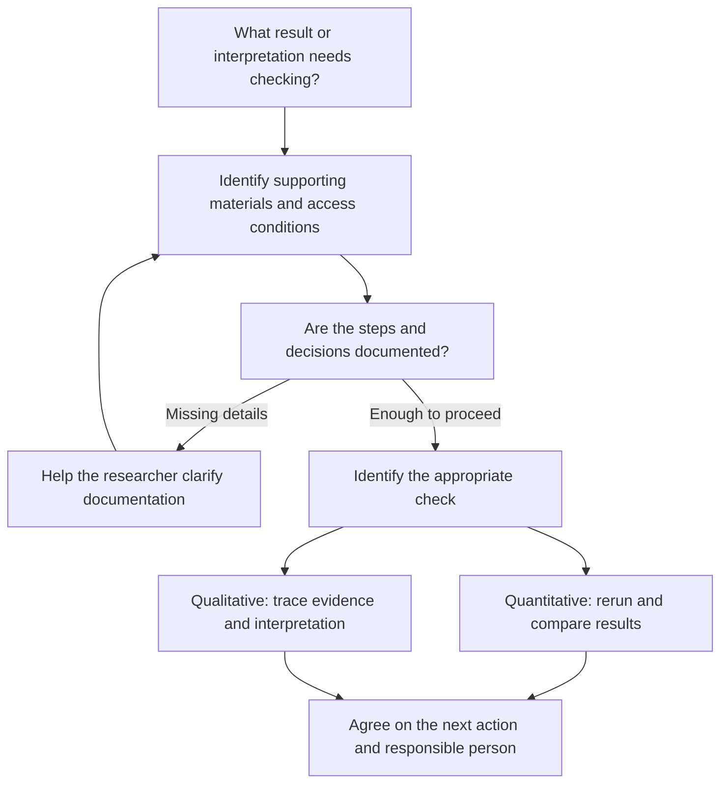

Revise the Reproducible Research Workflows lesson in `/Users/timdennis/projects/lessons/content/lc-reproducible-research` to strengthen the narrative across episodes, improve the organization of the longer episodes, and give librarians a practical takeaway. Implement and validate the changes, rather than stopping at another review or plan.

Read the local instructions and inspect the current working tree first. There are existing uncommitted corrections; preserve them. The current files take precedence over historical review findings. Read these notes in order, distinguishing resolved findings from remaining recommendations:

- `dev/notes/HANDOFF.md`
- `dev/notes/validation-review-2026-09-16.md`, including the CLDT addendum
- `dev/notes/validation-review-2026-09-18.md`
- `dev/notes/narrative-review-2026-09-18.md`

This request authorizes the bounded narrative and organizational changes below, including a justified split of the current Overview episode. State which files you intend to change, then proceed. Do not commit, push, open a PR, or change lifecycle status.

Purpose and audience

This is an introductory Library Carpentry lesson for librarians and research-support staff with no assumed programming or statistics background. Its practical outcome should be clear throughout:

Help a researcher identify what another person would need to follow the work, recognize missing information, and agree on a useful next action or referral.

Preserve the three current lesson-level outcomes: distinguish reproduction/replication/openness; select a practice for a workflow gap; recommend a realistic support action and identify when a partner is needed. Libraries can provide technical services where staff have the expertise. Do not imply either that every librarian must personally reproduce an analysis or that librarians can only refer technical work elsewhere.

Read these sources before revising

- CLDT: https://carpentries.github.io/lesson-development-training/aio.html
- The Turing Way: https://book.the-turing-way.org/reproducible-research/reproducible-research/
- Research compendia: https://book.the-turing-way.org/reproducible-research/compendia/
- Curating for Reproducibility Workflows: https://librarycarpentry.github.io/lc-curation-workflows/
- Data Quality Review: https://librarycarpentry.github.io/lc-curation-workflows/01-dqr.html
- Documentation Review: https://librarycarpentry.github.io/lc-curation-workflows/03-doc-review.html
- Reproducibility Assessment: https://librarycarpentry.github.io/lc-reproducibility-assessment/
- Output Review: https://librarycarpentry.github.io/lc-reproducibility-assessment/03-review.html

Borrow the idea of examining the connections among project materials, documented steps, and reported results. Adapt file/documentation questions and the habit of agreeing a next action with the researcher. The curation sequence's full code execution, archival processing, deposit acceptance, and certification workflows are outside this lesson's scope. Its published pages include pre-alpha notices and unfinished exercises: credit useful concepts without treating the sequence as a validated course. Attribute adapted material to its specific source and follow its license. Do not import its entire taxonomy or checklist.

Narrative changes

Keep Cool Access LA, the fictional mixed-methods heat-equity case. Preserve its current domain and explicit fictional labeling. Retain substantial use in the concepts and tools material, with brief references in Benefits and Challenges and the library-role conclusion. A split episode may distribute the existing case material across the resulting pages; it should not generate extra plot or case repetition.

Give each part a clear job:

1. Introduction: establish what a librarian can do with this knowledge. Add the practical support outcome to the existing framing.
2. Concepts: clarify what someone wants to check and what counts as evidence. End with a question about what information we would request from a researcher.
3. Benefits and Challenges: identify a barrier and a feasible next action. Keep the case reference short; avoid making restricted interview access the only recurring problem.
4. Tools: connect specific gaps to practices and recognizable artifacts. Keep the existing tool list, but integrate practice with the explanations.
5. Library role: finish with a concrete support response and responsibility, using the existing exercise time.

These numbers describe the current structure; update them if an episode is split. Preserve useful content rather than rewriting every paragraph. Avoid editorial history or explanations of past AI reviews in learner-facing text.

Chunking the longer episodes

Evaluate a two-part split of the current `reproducible-research-overview.md`. The preferred candidate is:

- Understanding reproducibility: definitions, arithmetic example, classification, and quantitative versus qualitative checking.
- Making research checkable: openness/access, Cool Access LA, and construction of open versus reproducible examples.

Before editing, briefly map the proposed content, objectives, assessments and timings. Implement the split if it produces two coherent teaching units. If it creates duplication or an undersized second unit, retain one page with clearly organized sections and explain why. Treat the 20–60-minute CLDT range as guidance. Splitting pages does not reduce total teaching time.

Consider making the crisis discussion optional context so it does not interrupt the practical narrative; preserve a meaningful explanation and its sources. Mark optional time separately.

For the current Tools episode, first improve its internal sequence rather than automatically adding another page:

- Can someone understand the materials? Documentation tools, codebook example, README activity.
- Can someone repeat the analysis steps? Scripts, version control, environments, Git scenario.
- Can someone trace the reported findings? Qualitative coding, annotations, reporting tools, qualitative activity.

Keep existing tools and connect exercises to the relevant explanations. Avoid a long uninterrupted catalogue followed by all the practice. Preserve assessment of the existing objectives, including the four-tool prompt unless you deliberately revise the corresponding episode objective and explain the reason.

Replace one exercise and strengthen the ending

Replace the existing six-minute README-template discussion with a short review of an intentionally incomplete fictional README. Keep the Cornell template as further guidance. For example:

"Cool Access LA survey analysis. Use survey.csv and analysis.R to make the chart in the report. Run it in R. Interview recordings are restricted; approved excerpts are included separately."

Ask learners to identify two details they would request and explain why. Model questions about the input version, variable definitions, run instructions, software requirements, and which figure/output to compare. Do not ask learners to invent missing facts or execute code. Include a solution and misconception guidance. Identify the artifact as invented teaching material.

In the existing library-role exercise, have learners produce a short response covering what is known, what is missing, and the next action and responsible person. Preserve local capacity and referral boundaries. Fit this into existing activity time rather than adding a capstone on top.

Mermaid diagram

Investigate whether the actual Workbench version/build supports Mermaid. Do not assume a fenced block renders just because it works in chat, and do not add unsupported scripts to the site. Use supported integration if available. Otherwise use a repository-compatible static rendering with the Mermaid source retained, or report the limitation and provide an accessible text equivalent.

Use this as a starting point, adjusting it to fit the revised lesson:

This depicts planning a check, not requiring the learner to perform it. Make clear that an authorized researcher, appropriately skilled librarian, or partner performs the check according to access rules and local expertise. Mixed-methods research can use both branches. Documentation being present does not certify reproducibility, and a successful rerun does not prove scientific correctness. Adjust the labels/arrows if they imply otherwise. Provide a concise caption and equivalent text explanation. Introduce the diagram briefly and return to it at the conclusion; avoid duplicating it on every page.

Validation and delivery

- Update episode order, questions/objectives/keypoints, titles, cross-references, glossary where needed, and instructor notes after restructuring. Preserve links where practical; check the consequences of any renamed or removed episode file.
- Map each stated objective to observable learner work. One exercise can cover several objectives. Keep examples and solutions consistent, including restricted versus public materials and quantitative versus qualitative checks.
- Reconcile every required activity allocation with episode totals, including instructions and debriefs. Separate optional activities. Report total teaching time and identify estimates as unpiloted. Aim to preserve or reduce the current core duration; explain any increase.
- Give instructors expected answers, likely misconceptions, essential checkpoints, and an optional-content route. Check for an existing pilot-feedback plan before adding a short one or a reference to it; do not claim outside workshop arrangements exist without evidence.
- Run the available carpentries-workbench-checker and `sandpaper::validate_lesson()` / `sandpaper::build_lesson()` using the repository's established environment. Report real results and any unavailable checks.
- Inspect the rendered changed pages, especially the diagram, challenge/solution nesting, navigation and glossary. Confirm the diagram renders rather than displaying raw source, and remains understandable through its text equivalent.
- Save a concise implementation note and update the existing handoff. Keep development notes under `dev/notes/`, outside the public lesson.

Finish with the episode structure, the concrete librarian takeaway, what was adapted from the sources, timing totals, validation results, and any remaining pilot questions. Leave a reviewable local diff. Do not call the lesson stable or claim the new timings have been proven by teaching.
