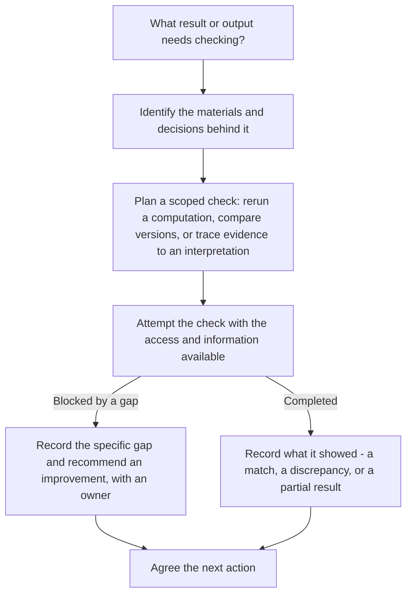

:::::::::::::::::::::::::::::::::::::: questions

- Why does reproducibility matter for research integrity?
- What does this lesson cover, and who is it for?

::::::::::::::::::::::::::::::::::::::::::::::::

::::::::::::::::::::::::::::::::::::: objectives

- Explain why reproducibility matters to research quality and trust
- Describe how this lesson connects to broader open science practices

::::::::::::::::::::::::::::::::::::::::::::::::

## Who this lesson is for, and what it covers

This lesson is written for library and research-support staff (data services librarians, research computing consultants, and similar roles) who want to help researchers make their work reproducible. No programming background is assumed.

By the end, given a research workflow, you should be able to identify what someone would need to follow or check it, recommend a concrete improvement where that connection has a gap, and explain who could carry out or assess the resulting check - a researcher's own team, an appropriately skilled librarian, or a partner service, depending on expertise and access. That's the practical skill this lesson builds toward, one episode at a time - not the same thing as actually completing a check yourself.

Over the next five episodes, you will move from concepts to practice: what reproducibility means and how it differs from replicability (episode 2), when reproducible work can still be checked even if it isn't fully open, using a recurring case (episode 3), the benefits and challenges researchers face (episode 4), concrete tools mapped onto each stage of a research workflow (episode 5), and where library services fit into supporting all of this (episode 6).

## Why does this matter?

Reproducibility is a key part of research integrity - meaning honest, careful, and accountable research practice. When research is reproducible, others can check your work, build on it, and reuse it with confidence.

For example: a researcher who deposits their raw data (their original, unprocessed observations), analysis code (saved instructions a computer runs), and a README (a short file explaining a project's contents and how to use it) has taken a real step toward making their work reproducible - though depositing those three things doesn't guarantee it on its own; a missing software version or an unclear step can still stop someone else cold. When a colleague downloads that package, reruns the same script, and gets the same numbers back - without emailing the original researcher to ask what "clean_data_v3_final.csv" actually contains - that successful rerun is what demonstrates the work is reproducible. Depositing the materials makes reproduction *possible*, if they're complete enough; someone actually redoing it successfully is what *confirms* it.

Making research reproducible helps:

- Improve the quality and reliability of results
- Respond to concerns about irreproducible studies in many fields, sometimes referred to as a "reproducibility crisis" (see episode 3 for more on this framing)
- Support broader changes in research, including global efforts to make science more open
- Align with funder, journal, and institutional expectations for transparency and rigor

In short, reproducible research strengthens science, supports collaboration, and helps researchers meet growing expectations for responsible research conduct.

## Reproducibility and open science

Reproducibility overlaps with, but is not the same as, **open science**: the broader movement toward making research outputs such as data, code, methods, and publications openly available, alongside wider goals like broadening who can participate in research and access its results equitably - this lesson focuses on the reproducibility piece, not that whole movement. Open science is one route to reproducibility (it is hard to reproduce a study you cannot access), but the two are not interchangeable. A dataset can be posted publicly with no documentation or version history, which makes it open, but its lack of documentation does not establish that it's reproducible. A research team can also make their full workflow reproducible for internal use while keeping the data itself restricted for privacy or licensing reasons, which makes it reproducible but not fully open. Episode 3 develops this distinction through examples.

::: challenge

## Openness or reproducibility? (~5 min)

A public dataset has no instructions and no documented steps for redoing the analysis. A different research team's dataset is restricted to approved collaborators only, but comes with a fully documented workflow that an authorized colleague has successfully rerun.

Which of these illustrates openness? Which illustrates reproducibility? Explain your answer in one sentence.

::: solution

The public dataset illustrates openness - it's accessible to anyone - but not reproducibility: the package alone doesn't provide enough information for another analyst to reliably repeat the reported analysis. Public access alone doesn't establish reproducibility. The restricted dataset illustrates reproducibility - a colleague successfully reran the documented workflow - without being open, since it isn't publicly accessible. A project can have either property, both, or neither.

:::

:::

::: discussion

(~3 min)

Before we go further: in your own words, why might a funder or journal care whether a study is reproducible?

**Possible answers**: reproducibility lets funders and journals verify that public or grant money produced results that hold up under scrutiny; it protects institutional and publication reputations against retractions; and it lets other researchers build on the work with confidence instead of re-doing it from scratch.

:::

## A process to build toward

The diagram below previews the kind of thinking this lesson develops: starting from a result someone wants to check, through identifying what supports it, to attempting a scoped check and agreeing on a next action. A check doesn't need everything documented perfectly first - a limited attempt is often how you discover exactly what's missing, and even a blocked attempt is useful once the specific gap is named. Who attempts the check depends on access and expertise: an authorized researcher, an appropriately skilled librarian, or a partner service. We'll return to this diagram at the end of the lesson.

*A librarian consultation flow: identify materials, plan a scoped check based on what's available, attempt it, and record what happened. Full traceability up front isn't required to attempt a limited check - the attempt itself is often what reveals a gap. A blocked attempt is still productive: it names a specific gap to close, with an owner. A completed check can show a match, a discrepancy, or a partial result, not always success - and either path ends in an agreed next action.*

::: callout
### Text equivalent of the diagram above

1. Start: what result or output needs checking?
2. Identify the materials and decisions that support it.
3. Plan a scoped check - for example, rerunning a computation, comparing versions, or tracing evidence back to an interpretation. Full traceability isn't required before attempting a limited check.
4. Attempt the check with the access and information actually available.
5. If the attempt is blocked by a gap: record exactly what's missing and recommend a specific improvement, with an owner.
   If the attempt is completed: record what it showed - a match, a discrepancy, or a partial result. Completing a check doesn't automatically mean it succeeded.
6. End: agree the next action, based on what's known so far.
:::

::: keypoints

- Reproducibility is central to research integrity and helps others check, build on, and reuse research
- Reproducibility and open science overlap but are not the same thing: openness helps enable reproducibility but does not guarantee it
- This lesson moves from concepts (reproducibility vs. replicability) and openness, to benefits and challenges, to tools, to the library's role in supporting all of it

:::
