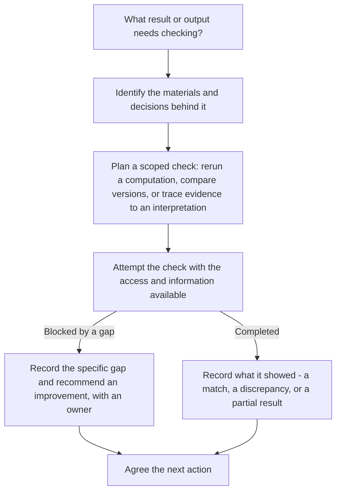

:::::::::::::::::::::::::::::::::::::: questions 

- What is the role of libraries in supporting reproducible research?
- How can library staff support researchers in improving reproducibility?

::::::::::::::::::::::::::::::::::::::::::::::::

::::::::::::::::::::::::::::::::::::: objectives

- Describe how libraries support reproducible research
- Given a description of a researcher's request, recommend a specific check with its limit, and identify who is positioned to carry it out

::::::::::::::::::::::::::::::::::::::::::::::::

## Why Libraries?

Libraries are well positioned to support reproducible research: many library services that already exist (open access support, research data management, documentation guidance) map directly onto what reproducibility requires. For example, a funder now requiring a **data management plan** (a document describing how a project's data will be organized, stored, and shared) with a documented, shareable dataset is asking for exactly the kind of support research data services already provide for other reasons.

As funders and journals begin to expect not only open but also reproducible research, libraries can expand their support. Librarians work across disciplines and with researchers at all career stages. This makes them key partners in promoting transparency and improving research workflows.

## How Libraries Support Reproducibility

No single librarian is expected to do all of the following, and none of it is off-limits to a librarian who has the skills, authorized access, and service mandate for it. Depending on expertise, access, and capacity, library staff can teach a practice, implement it directly, collaborate with the research team, or bring in a specialist to assess it. Library staff can help by:

- Raising awareness and offering training on reproducible research (a familiar entry point for many libraries, though designing good training is itself a real skill, not a trivial add-on)
- Supporting transparent research practices, including documenting methods, sharing data, and explaining analysis steps
- Helping researchers create clear, consistent documentation for all stages of a project
- Reviewing a project's documentation and workflow for clarity and completeness, so someone - the researcher's own team, or an appropriately skilled and authorized librarian - can rerun it later
- Advising on version control tools to track changes in code, data, or manuscripts, at whatever depth local skills support: pointing to a resource, troubleshooting hands-on, or referring to a research computing partner
- Directly comparing versions of a committed script to identify exactly what changed, or helping restore a documented computing environment from a recorded lockfile - concrete technical tasks some libraries take on themselves, where staff have the tools and training for it

::: challenge

## Which service applies? (~4 min)

Dr. Torres, from Cool Access LA in the previous two episodes, emails you: "My interview recordings have to stay in a secure, IRB-approved system for privacy reasons, but my funder is now asking for a **reproducibility statement** (a description of what someone would need in order to check or rerun the work, including any access limits). I have my analysis scripts and some scattered notes, but nothing written up in a way someone else could follow, and I don't know where to start. What would you help me document first, and who would handle any decisions about access?"

Which of the services listed above would you reach for first? Write your answer as a short three-line note: what you know, what's missing, and the next action - including a specific check that would show whether the improvement helped, who would perform it, and what it would and wouldn't tell you.

::: solution

**What we know**: the interview recordings must stay in the secure, IRB-approved system; the funder wants a reproducibility statement; Dr. Torres already has scripts and notes, but says herself that nothing is written up yet.

**What's missing**: not the underlying materials - she has those - but a documented account of the data processing and analysis steps, organized clearly enough for another approved team member to follow. Start by looking at what her scripts and notes already cover before assuming a gap; the missing piece may be organization and explanation, not content from scratch. "Reproducible" does not require the recordings to leave the secure system or become public - that's an openness question, not a reproducibility one.

**Next action**: start a documentation and workflow review with Dr. Torres - reading through what she has, then helping her fill in and organize the rest. Once a first version exists, the concrete check is: an authorized member of Dr. Torres's own team retraces one specific claim in the draft report - for example, the interview claim about walking to the library for air conditioning - through its approved excerpt and analytic note, recording where the explanation holds up and where it's still thin. That check shows whether the documentation is followable for *that* claim; it doesn't confirm the survey analysis is reproducible, which would need a separate rerun. Decisions about access to the restricted recordings stay with Dr. Torres's team and their IRB protocol.

:::

**Alternative scenario, same case** (use instead of the one above, not in addition - both fit the same four minutes): Dr. Torres's collaborator can't recreate the software setup needed to rerun the analysis on a new machine. What service or partner would you point them to, and what specific check would confirm whether it's fixed?

::: solution

Start by checking the setup instructions and recorded software versions - a missing dependency or an unrecorded version is often the actual cause, and that's a documentation gap you can help close. Where a librarian has the skills, the concrete check is comparing the recorded package versions (e.g. in a lockfile) against what's actually installed on the collaborator's machine, noting exactly which versions differ. That comparison shows whether the *environment* now matches what's recorded - it does not by itself confirm the analysis reproduces; that still needs an actual rerun once the environment is fixed. If rebuilding the environment itself needs expertise beyond what's locally available, refer the researcher to research computing or an appropriate IT partner.

:::

:::

::: discussion

## Reflection (~4 min)

What is one area where you think libraries can make the biggest difference in supporting reproducible research? Given your own library's staffing and expertise, which of the areas above feel realistic to take on, and which would need new skills or partners?

**Possible answers**: awareness-raising and documentation support are realistic starting points for most libraries since they build on existing reference and instruction skills. How far a library can go with version-control or environment-management tasks varies a lot by staffing - some libraries have people who do this hands-on, others rely on training up existing staff or partnering with a research computing group. Neither is the "correct" level; the point is knowing which one describes your library.

:::

## Back to the process from the Introduction

Recall the consultation flow from the Introduction: identify what needs checking, find the materials and decisions behind it, plan and attempt a scoped check, and agree a next action - whether the attempt was blocked by a gap or completed. Every exercise in this lesson - the packet-connection and README questions, the Git scenario, the qualitative-auditability question, and the two scenarios above - has been one pass through that same flow.

*The same librarian consultation flow from the Introduction. Which parts a library takes on varies by staffing and expertise, not a fixed division of labor: some libraries mainly help identify materials and plan a check; others, with the right skills and access, also attempt the check itself. What matters is agreeing who does what for a given request - the same judgment call this episode's exercises asked you to make.*

::: callout
### Text equivalent of the diagram above

1. Start: what result or output needs checking?
2. Identify the materials and decisions that support it.
3. Plan a scoped check - for example, rerunning a computation, comparing versions, or tracing evidence back to an interpretation. Full traceability isn't required before attempting a limited check.
4. Attempt the check with the access and information actually available.
5. If the attempt is blocked by a gap: record exactly what's missing and recommend a specific improvement, with an owner.
   If the attempt is completed: record what it showed - a match, a discrepancy, or a partial result. Completing a check doesn't automatically mean it succeeded.
6. End: agree the next action, based on what's known so far.
:::

::: keypoints

- Libraries are natural partners in supporting open and reproducible research, because much of the required support already exists as library services under other names
- Library support for reproducibility ranges from familiar entry points (awareness, documentation) to more specialized, technical services (version control, environment comparisons) - which level a given library offers depends on staffing and expertise, not a fixed rule about what librarians do or don't do
- Reproducibility support builds on existing library expertise in research data and scholarly communication

:::
