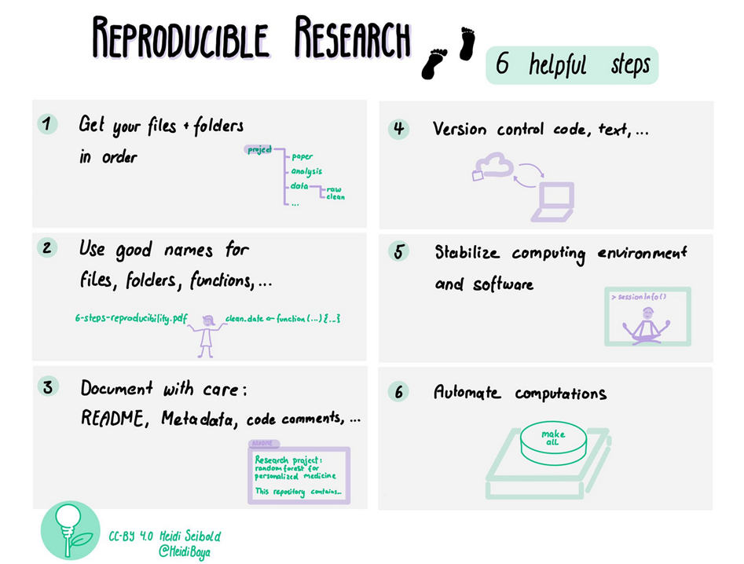

:::::::::::::::::::::::::::::::::::::: questions 

- What are reproducible research workflows?
- Which stages of the research process can be made more reproducible?
- What tools can help improve reproducibility?

::::::::::::::::::::::::::::::::::::::::::::::::

::::::::::::::::::::::::::::::::::::: objectives

- Identify key stages in a research workflow
- List at least four tools that support reproducibility
- Explain how some of these tools can be used in practice

::::::::::::::::::::::::::::::::::::::::::::::::

## What is a Reproducible Research Workflow?

A research workflow is the sequence of steps a researcher takes to produce outputs like a dataset, an analysis, or a publication.

Reproducibility can be improved in three key areas:

1. **Data collection and processing**
2. **Data analysis**
3. **Writing and reporting results**

:::: callout
Using the right tools helps researchers automate tasks, track changes, and make their work easier to reproduce and reuse. Without them, even well-intentioned practices can fall short.
::::

## Tools by Research Stage

Different tools support different parts of the workflow. Below are examples by stage.

### 1. Data Collection and Processing

Good documentation makes data collection methods clear and reusable.

- **README files** – Describe datasets and folder structure  
  [Cornell template](https://data.research.cornell.edu/content/readme)
- **Codebooks** – Define variables, labels, and units  
- **Electronic Lab Notebooks (ELNs)** – Digital logs for lab work (e.g. Jupyter, LabArchives)

### 2. Data Analysis

Tools vary based on the type of research (quantitative vs qualitative).

#### Quantitative Analysis

- **R**, **Python**, **SPSS Syntax** – For scripting and transparency
- **Git** – Version control for code and data
- **Code quality tools** – [The Turing Way: Code Quality](https://the-turing-way.netlify.app/reproducible-research/code-quality.html)
- **Containers** – Freeze environments (e.g., [renv](https://the-turing-way.netlify.app/reproducible-research/renv/renv-options.html))
- **Code Ocean** – Share executable code capsules: [https://codeocean.com](https://codeocean.com)

#### Qualitative Analysis

- **Annotations** – Tools like [NVivo](https://help-nv11.qsrinternational.com/desktop/concepts/about_annotations.html) or [ATI](https://qdr.syr.edu/ati)
- **Active Citation** – Linking sources to analysis: [example](https://www.princeton.edu/~amoravcs/library/ps.pdf)

### 3. Writing and Reporting

Tools for integrating code, results, and narrative.

- **R Markdown** – Combines R code with text
- **Quarto** – Supports multiple languages; markdown-based
- **Jupyter Notebooks** – Combine live Python code with results and narrative
- **HackMD** – Collaborative markdown editor for co-writing
- **Overleaf** – Online LaTeX for polished documents

:::::::: challenge

## Exercises

1. Visit this [README template](https://data.research.cornell.edu/data-management/sharing/readme/).  
   - How could you support a researcher in completing it?  
   - Which sections would benefit most from library support?

2. What tools can help make qualitative research more reproducible?  
   - If these tools aren't available, what alternatives might work using familiar tools?

:::::::::::::

:::::::: keypoints

- Research workflows include data collection, analysis, and reporting
- Each stage offers opportunities to improve reproducibility
- Many tools exist to support documentation, versioning, and sharing

::::::::::: 
