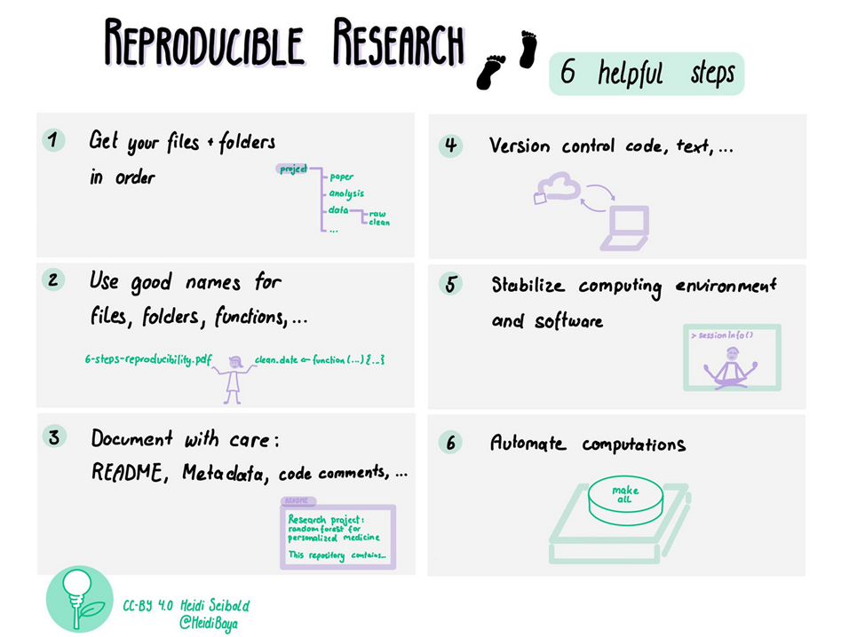

:::::::::::::::::::::::::::::::::::::: questions 

- What are reproducible research workflows?
- Which stages of the research process can be made more reproducible?
- What tools can help improve reproducibility?

::::::::::::::::::::::::::::::::::::::::::::::::

::::::::::::::::::::::::::::::::::::: objectives

- Identify key stages in a research workflow
- Given a workflow gap, identify a practice or artifact that would address it, and describe what a check based on it would show - or would still leave open
- Describe, for a documentation tool and a version-control tool, one specific task it would be used for in a research project

::::::::::::::::::::::::::::::::::::::::::::::::

## What is a Reproducible Research Workflow?

A research workflow is the sequence of steps a researcher takes to produce outputs like a dataset, an analysis, or a publication.

Reproducibility can be improved in three key areas:

1. **Data collection and processing**
2. **Data analysis**
3. **Writing and reporting results**

The illustration below lists six concrete practices that cut across those three stages, from organizing files at the start of a project through automating the final computations:

{alt="Illustration titled Reproducible Research: 6 helpful steps, showing six numbered practices: 1. get your files and folders in order, 2. use good names for files, folders, and functions, 3. document with care using README files, metadata, and code comments, 4. version control code and text, 5. stabilize the computing environment and software, 6. automate computations. Credit: Heidi Seibold, CC-BY 4.0."}

:::: callout
Using the right tools helps researchers automate tasks, track changes, and make their work easier to reproduce and reuse. Tools alone will not fix an undocumented, disorganized project, but without them, even well-intentioned practices are hard to sustain over the life of a project.
::::

::: challenge

## Sort the stages (~3 min)

Before reading further, try sorting these tasks into the three workflow stages above (data collection and processing / data analysis / writing and reporting): describing what each survey column means, calculating a result from the data, writing up the findings, and keeping a record of changes to a script.

::: solution

- **Data collection and processing**: describing what each survey column means (this is what a codebook does)
- **Data analysis**: calculating a result, keeping a record of changes to a script (version control is most often introduced once code exists to track, so it spans analysis and reporting)
- **Writing and reporting results**: writing up the findings

:::

:::

The tools below are grouped by three questions you'll ask in almost every consultation, rather than by workflow stage alone: can someone **understand the materials**, can someone **repeat the analysis steps**, and can someone **trace the reported findings**? These roughly track data collection, analysis, and reporting, but the questions matter more than the labels - they're what you're actually checking for, in any order the conversation happens to go.

## Can Someone Understand the Materials?

Good documentation makes data collection methods clear and reusable, so someone else can navigate a project without asking you.

- **README files** – A plain-text file stored alongside a dataset or project that describes its contents, structure, provenance, and terms of use: [Cornell template](https://data.research.cornell.edu/data-management/sharing/readme/)
- **Codebooks** – A document that records, for each variable in a dataset, its name, meaning, permitted values, units, and how missing data is coded
- **Electronic Lab Notebooks (ELNs)** – A digital replacement for a paper lab notebook, used to record experimental procedures, observations, and results in a searchable, shareable form (e.g. Jupyter as a notebook interface, or a dedicated ELN platform like LabArchives)

**Cool Access LA**: recall the project packet from [Making Research Checkable](making-research-checkable.md). A **README and codebook** explain what each survey column means and note which files (the interview recordings) are restricted and why. The codebook entry from that packet: `q1a = days in the past 7 days when the respondent could not reach a cooling space; allowed values 0-7; 99 = no answer`. (This is invented teaching data, not a real survey.)

::: challenge

## What would go wrong here? (~2 min)

Looking at the codebook entry above (`99 = no answer`), what would happen if someone analyzing this data treated `99` as if it were a real count of days, rather than a missing-data code?

::: solution

It would badly distort any calculation involving that column - averages, totals, or comparisons would be skewed upward by treating "no answer" as "99 days," which isn't a real possible value (there are only 7 days in a week). This is exactly the kind of error a codebook prevents: without it, a second analyst has no way to know 99 is a special code rather than real data.

:::

:::

::: challenge

## What would you ask for - and what would you do next? (~6 min)

Dr. Torres's research assistant hands off this note along with the project folder (this is invented teaching material, not a real project):

> Cool Access LA survey analysis. Use `survey.csv` and `analysis.R` to make the chart in the report. Run it in R. Interview recordings are restricted; approved excerpts are included separately.

With a partner:

1. Identify one missing connection between this note and the packet from [Making Research Checkable](making-research-checkable.md) - the same kind of gap the "What connects to what?" question there asked about.
2. Propose one specific improvement that would close it. If you don't know a fact (like an exact software version), write an explicit placeholder for it ("record the R and package versions used here") rather than inventing one.
3. Explain what check that improvement would then make possible.

::: solution

1. Missing connection: the note doesn't say which version of `survey.csv` produced the chart, or what software/package versions `analysis.R` needs. (No codebook is mentioned either, but that's covered separately above.)
2. Improvement: add a line to the project's README naming the exact `survey.csv` version used (e.g. a dated filename or a Git commit reference) and the R and package versions `analysis.R` requires.
3. What it enables: with that recorded, a second analyst could rerun `analysis.R` against the named data version, in a matching environment, and compare the result to the report's figure - a reproducibility check that the hand-off note alone doesn't currently support. If the interview excerpts matter to the request, the documented access route is the thing to ask for, not the restricted recordings themselves.

**Anticipated misconception** (not yet observed in teaching): learners may suggest asking for the restricted interview recordings directly. Redirect to the documented access route - the reproducibility question here is about the survey analysis; the interview restriction is a separate openness boundary to recognize, not work around.

The [README template](https://data.research.cornell.edu/data-management/sharing/readme/) above is a useful reference for what a complete version of this README would look like once written down.

:::

:::

## Can Someone Repeat the Analysis Steps?

Tools vary based on the type of research (quantitative vs qualitative). This section covers the quantitative tools; the next covers qualitative coding and annotation, plus the reporting tools both kinds of work eventually pass through.

- **R**, **Python** – Programming languages commonly used for data analysis; both let you save your analysis as a **script** (saved computer instructions that can be re-run to repeat a task), so the steps are transparent and repeatable
- **SPSS Syntax** – A saved set of commands that repeats an analysis in the SPSS statistical software package, playing the same transparency role as an R or Python script
- **Git** – A version control system that records successive changes to code, text, or data files over time, so any earlier state can be recovered and the history of who changed what is preserved
- **Code quality tools** – Tools and practices for checking that a calculation behaves as expected, e.g. through automated tests: [The Turing Way: Code Quality](https://the-turing-way.netlify.app/reproducible-research/code-quality.html)
- **Environment management** – Tools that record the exact software versions and **dependencies** (additional software a project's code needs to run) a project used, so it can be re-run the same way later or on another machine. This is often done with lightweight, language-specific tools such as [renv](https://the-turing-way.netlify.app/reproducible-research/renv/renv-options.html) for R, which records and helps restore the exact versions of R **packages** (reusable, shareable bundles of software code) a project used - or with full containers (e.g. Docker) that package the entire operating environment. renv is not itself a container; it produces something closer to a **lockfile** (a record of the exact dependency versions needed to recreate an environment later).
- **Code Ocean** – Share "code capsules" (a code capsule bundles your code, data, and computing environment together so someone else can run it without recreating your setup): [https://codeocean.com](https://codeocean.com)

**Cool Access LA**: **Git** tracks changes to the analysis scripts as the team revises them, so an earlier version can always be recovered. **Environment management** (renv) records the exact R package versions used, helping the team recreate the same computing environment for a later rerun.

::: challenge

## A version-control scenario (~4 min)

The team already uses Git and committed yesterday's working script. Today, Dr. Torres's research assistant edited the analysis script and the resulting figure changed; the input data and software environment are unchanged. A collaborator asks what changed and whether yesterday's figure can be recovered. Which tool from this episode would you reach for, and what would you do with it?

::: solution

Git. You would compare the current version of the script against yesterday's version to see exactly what changed, and you could recover the earlier version of the script (and re-generate the earlier figure) if needed. This doesn't tell you which figure is scientifically correct - only documentation and re-analysis can establish that - but it does let you inspect and recover the change itself.

:::

:::

## Can Someone Trace the Reported Findings?

Whatever the method, tracing a finding means seeing how it connects to its evidence. For a computational result, that check often means rerunning a calculation. For a qualitative interpretation, it usually means tracing evidence and reasoning back to source material. Many projects need both at once - Cool Access LA's report has a quantitative figure and a qualitative claim side by side, each needing its own kind of check, and a project with computational steps in its qualitative workflow (like the coding software below) can need a rerun-style check there too.

- **Coding and annotation** – Free, open-source qualitative analysis software such as **QualCoder** or **Taguette**, used for **coding** qualitative source material: attaching descriptive labels (a **coding scheme**) to passages of text to organize and interpret them - distinct from writing program code. The software itself doesn't make an analysis **auditable**; what does is keeping the coded excerpts, the applied labels, and the analytic notes explaining each decision together and reviewable - the tool just makes that easier to do consistently than a scattered set of documents would. Both tools have their own dedicated Library Carpentry lessons if you want to go deeper: [Open Qualitative Research with QualCoder](https://librarycarpentry.github.io/lc-qualitative-qualcoder/) and [Open Qualitative Research with Taguette](https://ucla-imls-open-sci.info/lessons/open-qualitative-research-taguette/)
- **Active Citation** – a practice for qualitative research where claims in a paper link directly to the specific passage of source material that supports them, along with a brief explanation of why that passage supports the claim - not just a hyperlink - so a reader can check the evidence without re-doing the whole analysis. For example: linking a claim about a resident's stated barrier directly to the relevant, de-identified excerpt of their interview transcript, with a sentence on why that excerpt supports the claim, rather than just a generic citation to "interview #14." [Active Citation example](https://www.princeton.edu/~amoravcs/library/ps.pdf). A more tooled-up descendant of this idea, ATI (Annotation for Transparent Inquiry), comes from the Qualitative Data Repository (QDR) at Syracuse - whose director, Sebastian Karcher, co-taught the pilot workshop for this lesson series' own [Taguette lesson](https://ucla-imls-open-sci.info/lessons/open-qualitative-research-taguette/) above

Once a finding - quantitative or qualitative - is ready to report, the writing tool matters less than what it preserves the connection to:

- **R Markdown** – Combines R code with text, both built on **Markdown**, a lightweight plain-text formatting syntax that converts to HTML, PDF, and other formats
- **Quarto** – Supports multiple languages; also markdown-based
- **Jupyter Notebooks** – The same Jupyter environment listed as an ELN above, used here for its other common purpose: combining live Python code with results and narrative for a written report
- **HackMD** – Collaborative markdown editor for co-writing
- **Overleaf** – An online editor for **LaTeX** (a document-preparation system commonly used for polished, technical documents)

**Cool Access LA**: the team codes interview transcripts in **QualCoder** or **Taguette**, then uses **Active Citation**-style annotation - each excerpt paired with a sentence on why it supports the claim - to link specific claims in the final report back to de-identified excerpts, without exposing the full restricted recordings. **Quarto** combines the quantitative survey results and the qualitative interview findings into one report - though assembling the writeup this way doesn't by itself reproduce the reasoning behind the qualitative findings; that traceability comes from the coding scheme and annotations above, not from the writing tool.

::: challenge

## Making qualitative analysis auditable (~5 min)

Dr. Torres's team wants to make their interview analysis auditable without exposing the restricted recordings. What tools or practices from this episode could help? If these tools are not available, what alternatives might work using familiar tools?

::: solution

QualCoder or Taguette for coding (both free and open source, and both covered in their own Library Carpentry lessons linked above), or Active Citation practices to link report claims to de-identified excerpts. Without access to specialized software, a documented coding scheme in a shared spreadsheet, plus a written record of the analytic decisions made (why a passage was coded a certain way), can substitute for at least part of what dedicated qualitative tools provide.

:::

:::

## Before You Go

::: challenge

## Before you go (~3 min)

Pick one workflow gap - your own example, or one from Cool Access LA - and answer in a few sentences:

1. What's the gap?
2. Which practice or artifact from this episode would close it?
3. What would that let someone check - and what would still be a limitation even after the gap is closed?

::: solution

Example: **Gap** - a script produces a figure but nothing records which version of the input data it ran against. **Practice** - version control on the script plus a named or dated data-file version (or a brief data-version note if full version control isn't set up). **What it enables** - a second analyst can confirm they're rerunning against matching inputs and compare results. **Limitation** - matching inputs and getting the same output confirms the analysis is reproducible; it doesn't by itself confirm the analysis method was the right one to answer the research question.

Any workflow gap, connected to a specific practice and a specific check plus its limitation, is a good answer. Naming a tool is useful shorthand for the practice, not the point of the exercise.

:::

:::

::: keypoints

- Research workflows include data collection, analysis, and reporting; each stage offers opportunities to improve reproducibility
- Match a tool to what you're actually checking: can someone understand the materials, repeat the analysis steps, or trace the reported findings
- Use documentation (README, codebook) to explain what your data and steps mean, and version control (Git) to inspect and recover changes to your code over time
- A named artifact (a script, a data file) only closes a gap once it's specifically connected to the claim it's meant to support - identifying that missing connection is as important as knowing the tool that could fix it

:::
