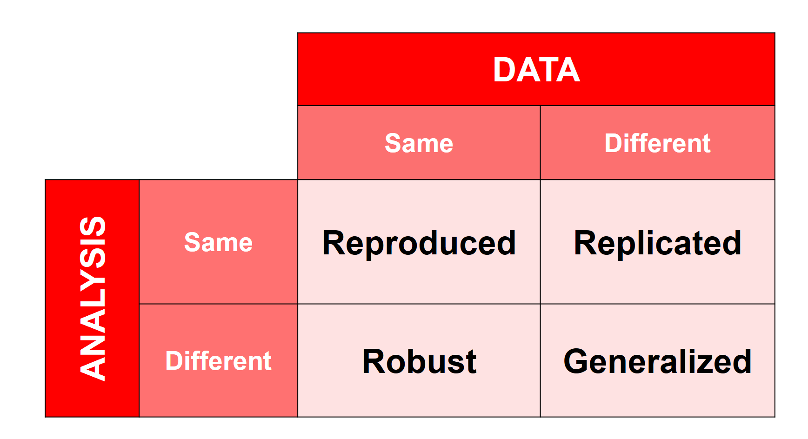

:::::::::::::::::::::::::::::::::::::: questions 

- What do we mean by reproducibility?
- When is research reproducible?
- Does reproducibility mean different things in different disciplines?


::::::::::::::::::::::::::::::::::::::::::::::::

::::::::::::::::::::::::::::::::::::: objectives

- Explain what research reproducibility is
- Construct examples showing where reproducibility and openness are not the same thing
- Contrast computational reproducibility with transparency of qualitative analysis


::::::::::::::::::::::::::::::::::::::::::::::::

## Reproducibility: Some Definitions

**Reproducibility**: Obtaining the same results using the same data and the same analysis steps.

**Replicability**: Achieving similar results with new data, using the same analysis steps to answer the same question.

Research is **reproduced** when results are consistent when following the same method and analysis steps with the same input data

Research is **replicated** when results are consistent across studies that answer the same research question, each of which has obtained its own data

Research results are **generalized** when results apply in other contexts or populations that differ from the original one

[Source](https://www.nap.edu/catalog/25303)

{alt="A 2x2 matrix crossing whether the data is the same or different (columns) with whether the analysis is the same or different (rows). Same data and same analysis is labeled Reproduced. Different data and same analysis is labeled Replicated. Same data and different analysis is labeled Robust. Different data and different analysis is labeled Generalized."}

**Robust** means a finding persists when reasonable, defensible changes are made to the analysis - a different but equally valid statistical test, for example. This matrix is a simplified organizing aid, not an exhaustive definition: generalization in particular is really about how far a finding's applicability extends, not just about changing both the data and the analysis at once.

Based on: [The Turing Way: Overview of reproducibility definitions](https://the-turing-way.netlify.app/reproducible-research/overview/overview-definitions.html)

::: challenge

## Which of these describes a reproduced study?

1. Researchers apply similar methods to the original study in a new study
1. Researchers re-analyze data from the original study and observe the same results
1. Researchers reuse data from the original study for a new purpose

Explain your answer in one sentence: what specifically stayed the same?

::: solution

2. Researchers re-analyze data from the original study and observe the same results. What stayed the same: the original data and the original analysis method - only the fact that someone else redid the analysis is new.

:::

:::

## Reproducibility: Some Examples

Let us consider an example: a researcher is tossing a coin 100 times to check how often it lands on tails. They register heads or tails after each toss. Heads are registered as 0 and tails as 1. The sample size of this study is N = 100 (since they are tossing the coin 100 times).

```
Sample size: N = 100
Heads = 0
Tails = 1
Analysis method = Count of tails, divided by total tosses
```

After all data is collected, the researcher calculates the proportion of tails: 53 tails out of 100 tosses, or 53%. The researcher makes the complete data table and detailed methods available to the public.

Another researcher downloads the data table and re-runs the exact same calculation in a different software, using the R programming language. They also get 53%. **They have reproduced the study** - same data, same calculation, same result.

A third researcher reads about the reproduced study and decides to investigate the same question with a new coin. They apply the exact same method: toss a coin 100 times, register heads as 0 and tails as 1, and calculate the proportion of tails. This time they get 49 tails out of 100, or 49%. **This is a replication attempt** - new data, same method, same question. Whether 49% “counts” as corroborating the first result is a judgment call, not an automatic yes or no; replication attempts do not always land on an identical number, and that is expected.

Note, however, that in many different disciplines the word “reproduced” could be used in both the second and the third researcher case, that is to mean both reproducing and replicating the study.

::: callout
The original version of this example used a statistical significance test (a Student t-test) to ask whether the coin was “fair.” We simplified it to a plain proportion on purpose: failing to detect a statistically significant difference from chance is not the same as proving the coin is fair, and building that subtlety into a reproducibility example risked teaching a statistical misconception alongside the reproducibility concept. If you want to extend this example for a more statistically sophisticated audience, a **Student t-test** is a common statistical test for comparing an observed average against an expected value - but be careful to teach that a non-significant result means “we did not detect a difference,” not “we proved there is none.”
:::

::: challenge

## Reproduced, replicated, or generalized? (~5 min)

For each scenario below, decide whether it describes reproducing, replicating, or generalizing a result. For each, name what stayed the same and what changed.

1. A team re-runs a colleague's published analysis script on the exact same dataset and gets the same numbers.
2. A team collects new survey data using the same questionnaire and finds a similar pattern of responses.
3. A team that found an effect in a lab study finds the same effect holds in a real-world field setting with a different population.

::: solution

1. Reproduced - same data, same method; nothing changed except who ran it.
2. Replicated - same method and question, but new data.
3. Generalized - the result was shown to extend to a different context/population, using a different setting rather than the original lab conditions.

:::

:::

::: discussion

(~5 min)

Can you provide additional examples of reproducible studies from various disciplines or research types?

:::

## Reproducibility Across Methodologies and Research Disciplines

**Quantitative** research analyzes numerical measurements; **qualitative** research analyzes meaning in non-numerical material such as interviews or documents; **computational** means carried out by a computer.

### Quantitative Studies: Computational Reproducibility

It is defined as “obtaining consistent computational results using the same input data, computational steps, methods, code, and conditions of analysis” ([https://www.nap.edu/catalog/25303](https://www.nap.edu/catalog/25303)). What it means is basically re-running analyses/code with the same data.

### Qualitative Studies: Process Transparency

For this lesson, qualitative transparency means documenting how material was selected, coded, and interpreted so another researcher can trace and critically assess the reasoning - not that they necessarily arrive at the same **interpretation** (the researcher's explanation of what the evidence means). Two researchers can trace the same evidence and reasonably interpret it differently; what matters is that the path to the interpretation is visible and can be scrutinized.

::: discussion

(~5 min)

What would you inspect to check a quantitative result, like a survey calculation? What would you inspect to trace a qualitative interpretation, like an analysis of interview transcripts? Discuss in pairs how these two kinds of checking differ.

:::

## Reproducibility and Open Research

### Reproducibility is closely associated with transparency.
In order to reproduce others’ studies we need to have access to the methods, data, and analyses that have been conducted. So making data, tools and analyses available is essential for reproducibility. 

### Reproducible does not (have to) mean fully open.
However, a reproducible project does not have to be fully open. For example, due to privacy or copyright restrictions on methods, data, or analyses, researchers might need to keep parts of the research outputs under controlled access (e.g. available only to other researchers and not publicly available). This should not prevent then, though, from making the project fully reproducible (e.g. internally within their research team). 

### Open does not mean reproducible.
On the other hand, it is entirely possible to practice open science without following reproducibility principles. Materials, data, tools and code can be made openly available but if they do not have necessary documentation, instruction on how to use them, error checks, proper versioning and organization - they are most probably not usable, and the project might not be reproducible.

{alt="Venn diagram showing that open and reproducible are overlapping but distinct categories of research practice"}

## A Recurring Example: Cool Access LA

::: callout
Starting here, this lesson returns a few times to a short fictional composite case, **Cool Access LA**. It is inspired by real UCLA heat-equity research, including the Heat Lab's [Red Hot LA: Mapping Energy Inequality](https://heatlab.humspace.ucla.edu/projects/red-hot-la-mapping-energy-inequality/) and a UCLA study on how [Los Angeles County residents use cooling centers during extreme heat](https://newsroom.ucla.edu/releases/cooling-centers-los-angeles-county-extreme-heat). Cool Access LA is not a real UCLA project, and nothing below describes any real research team's actual workflow, tools, or data. It is a teaching composite, built to be realistic without being real.
:::

**Cool Access LA**: Dr. Maya Torres, an urban studies researcher, is studying whether residents of a Los Angeles neighborhood can reach and use public cooling spaces, including public libraries, during extreme heat. Her team combines city temperature and facility-location data with a short household survey and a handful of resident interviews about barriers to using cooling centers. The survey data can be shared once identifying details (details that could reveal who a participant is) are removed and each participant has approved sharing their specific excerpt; the interview recordings themselves must stay restricted to protect participants.

::: challenge

## Reproduced, replicated, or just open?

1. A second analyst reruns Dr. Torres's original scripts on the same survey data and gets the same results.
2. A team in a different city collects its own survey and interview data, using the same questions and the same analysis method, and finds a similar pattern.
3. Dr. Torres shares her survey dataset and analysis code, but keeps the interview recordings restricted to protect participants.

Which of these is reproduction? Which is replication? Does restricting the interview recordings stop the project from being reproducible?

::: solution

1. Reproduction - same data, same method.
2. Replication using new data. Because the setting also changes (a different city), this can additionally provide evidence about generalizability - one matching result in a new place does not prove the finding holds everywhere, but it is a data point toward that.
3. This is not reproduction or replication, it is about **openness**. The survey analysis can be reproduced if the documented workflow runs successfully for someone else - that is a reproducibility question. Whether the interview recordings are public is a separate, openness question. An authorized reviewer could still trace the interview analysis using Dr. Torres's coding records and decision notes, even without the recordings becoming public. Restricting some material does not automatically make the rest of the project unreproducible.

:::

:::

::: challenge

## Now you construct the examples (~4 min)

Using Cool Access LA, describe:

1. A version where the survey is **open but not yet reproducible**.
2. A version where the analysis is **reproducible for authorized colleagues but not public**.

::: solution

1. Open but not reproducible: Dr. Torres posts the raw survey data online with no codebook, no documented analysis steps, and no explanation of what the column names mean. Anyone can access it, but no one - including Dr. Torres's own future self - could redo the analysis from what is provided.
2. Reproducible but not public: Dr. Torres's team keeps a fully documented workflow (README, codebook, analysis scripts, version history) in a private repository shared only with the funder's designated reviewers, who successfully rerun it. It is reproducible for that audience without being open to the public.

:::

:::

## Reproducibility Crisis

Problems with reproducibility of research have been noticed by many researchers, advisors and policy makers in the past several years and led to some even claim that there is a [“Reproducibility crisis”](https://www.nature.com/articles/533452a).
However, not everyone agrees the "crisis" framing is the right one. Two examples that push back on it, from different angles:

- [Is science really facing a reproducibility crisis, and do we need it to?](https://www.pnas.org/doi/full/10.1073/pnas.1708272114) (Fanelli, 2018) - questions whether the evidence supports "crisis" as an accurate description of the problem
- [The reproducibility debate is an opportunity, not a crisis](https://bmcresnotes.biomedcentral.com/articles/10.1186/s13104-022-05942-3) (Munafò et al., 2022) - argues the current attention on reproducibility is better framed as a chance to improve research practice than as a crisis to be alarmed about

### Reasons for Irreproducibility

- Unavailability of materials, data and/or analyses
- Poor data management
- Unclear analysis specification
- Lack of documentation
- Errors in reporting numbers
- Lack of quality checking procedures
- Insufficient peer review

::: discussion

(~10 min)

Do you agree that “crisis” is the right framing, based on the two perspectives above? What evidence would help you judge how big the problem actually is? Looking at the list of reasons for irreproducibility above, which one do you think a library service is best positioned to address?

:::


::: keypoints

- Reproducibility usually means obtaining the same results with the same data and the same analysis steps.
- Across different disciplines and methodologies, the understanding of what reproducibility means can be very different.
- Reproducible research is not the same as open research - it is important to share research outputs to be able to reproduce others’ studies, but research can be made fully reproducible even if it cannot be made fully open. 
- Recent studies point to many issues with reproducibility across different disciplines, something that has been termed “reproducibility crisis”

:::
